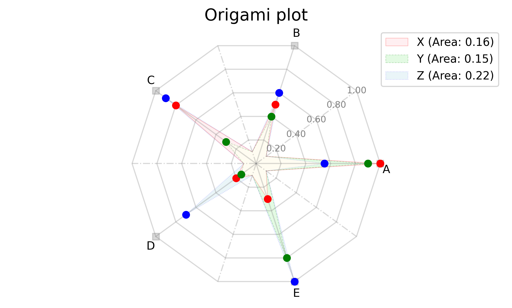

# origami_plot_python
The origami plot realization in python
Currently, only the same scale is supported for different variables without additional weighting.

Inspired by [article](https://www.sciencedirect.com/science/article/pii/S0895435623000410)

Example:

